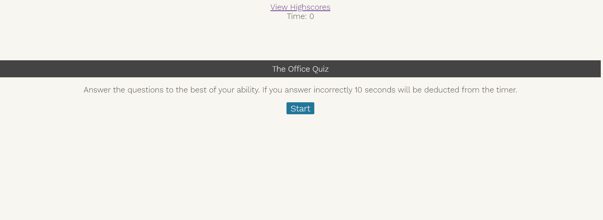
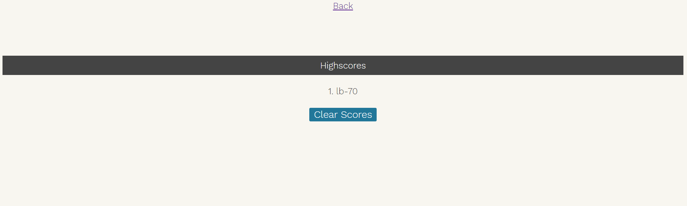

# Coding-Quiz
This project uses Javascript to design a simple quiz game. In this game the users answers questions realted to the tv show "The Office". Once the user completes the quiz they are able to save their score to a Highscores page where the user is also able to see other scores from other players.

## Motivation
This project was created to showcase my knowledge of Javascript in a practical application.

 
## Screenshots

## Features
The user is able to save and view highscores. The user can also clear old highscores with the Clear button. 

## Installation
Simply clone the repository from Github in order to edit the code. 

## How to use?
Click the "Start" button to begin the quiz. Once the quiz starts you will be able to select the best answer for each question. If you choose incorrectly 10 seconds will be taken from the timer. After you have answered all quesions or run out of time your score is calculated based on how much time is left. You can then save your score to the Highscores page where you can also view other people's scores.

## Credits
https://www.sitepoint.com/simple-javascript-quiz/
